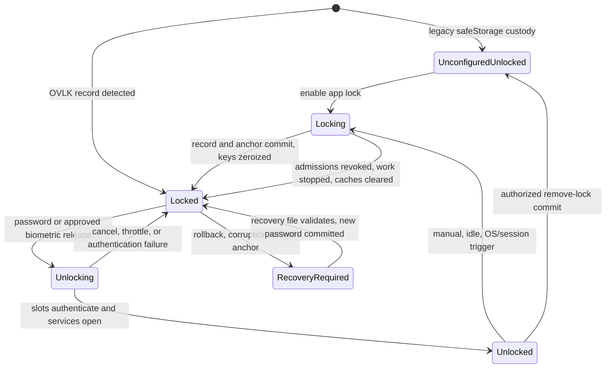

# ADR-0013: App Lock, Key Release, and Protected Albums

## Status

Accepted 2026-07-16 on [#308](https://github.com/qwts/photos/issues/308) after the threat-model/recovery pass below and the [#322 review](https://github.com/qwts/photos/pull/322) found no major issues. This ADR extends [ADR-0004](./ADR-0004-Encryption-And-Key-Management.md) and [ADR-0008](./ADR-0008-Recovery-Key-Format.md); it does not rewrite either decision.

## Context

The existing library master key is automatically released by Electron `safeStorage` and remains in the main process while the library is open. A renderer-only password screen would therefore hide pixels without withholding decryption authority. App lock must instead prevent the main process from opening the SQLCipher database, resolving library keys, serving custom protocols, exporting, restoring, or running background work until an authorized key-release ceremony succeeds.

The same contract must support native Touch ID without storing biometric data, preserve the exported recovery-key guarantee, and give protected albums an independent authorization domain. Password, recovery, lifecycle, biometric, and album decisions are made together because a partial design creates bypasses between those surfaces.

## Decision

### 1. Key hierarchy and password record

ADR-0004's random 32-byte library master key `M` remains the recovery root. Enabling app lock creates a separate random 32-byte unlock key `U`:

```text
app password --scrypt--> password key P --AES-256-GCM--> U
U ---------------------------------------AES-256-GCM--> M
M ---------------------------------------AES-256-GCM--> versioned library keys
```

The password never wraps library keys directly. Rotating the app password rotates `U`, rewraps `M`, and leaves the master and versioned library keys unchanged. This keeps existing envelopes, database custody, provider backups, and the ADR-0008 recovery file stable.

`master.key` becomes a versioned custody container when lock is configured. Legacy unconfigured libraries retain the current opaque `safeStorage`-wrapped master. A configured record is canonical JSON prefixed by the unambiguous magic `OVLK` and has this logical schema:

```json
{
  "version": 1,
  "libraryId": "...",
  "generation": 1,
  "kdf": {
    "name": "scrypt",
    "N": 131072,
    "r": 8,
    "p": 1,
    "salt": "base64(16 bytes)"
  },
  "passwordSlot": {
    "algorithm": "AES-256-GCM",
    "nonce": "base64(12 bytes)",
    "ciphertextAndTag": "base64(U ciphertext plus 16-byte tag)"
  },
  "masterSlot": {
    "algorithm": "AES-256-GCM",
    "nonce": "base64(12 bytes)",
    "ciphertextAndTag": "base64(M ciphertext plus 16-byte tag)"
  }
}
```

The canonical header, library id, generation, slot name, and algorithm identifiers are AAD. Password-slot authentication is the verifier; no second password hash or comparison value is stored. Unknown magic, version, parameters, algorithms, lengths, duplicate fields, or non-canonical encodings fail closed before KDF work. Fixed KDF parameters cannot be downgraded by editing the file. A future cost change increments the format version.

Version 1 uses ADR-0008's scrypt profile: `N=2^17`, `r=8`, `p=1`, 32-byte output, 16-byte random salt, and a 160 MiB memory ceiling. The main-process schema also enforces an 8–1024 character password and the existing strength score ≥3 when creating or changing it. Fresh salt, nonces, and `U` are generated for every change.

An OS credential-store anchor, kept outside the library/backup directory, stores only `{libraryId, generation, SHA-256(record)}`. It is not an unlock secret. The adapter uses Keychain on macOS, Credential Manager on Windows, and Secret Service on Linux; a `safeStorage`-sealed file beside the library is not an anchor because an attacker could roll that file back with the custody record. If the platform store is unavailable, app lock cannot be enabled and an already configured profile stays recovery-required. A record rollback, replay from another library, anchor mismatch, corrupted anchor, or missing anchor on an existing configured profile enters locked recovery-required state. A fresh-machine restore has no anchor by definition and establishes a new record and anchor only after ADR-0008 recovery succeeds.

Enabling, changing, removing, and recovering lock use a small transition journal plus temp-file/fsync/rename and a two-phase anchor update. The anchor atomically records the committed generation and, during transition, one pending generation/hash. Startup accepts the committed pair, completes an exact pending pair, or aborts a pending update when the committed pair is still intact; every other combination requires recovery. Any mixed crash state resumes with fresh authorization or stays locked; it never falls back to the legacy keychain path. Removing lock requires current password or the recovery ceremony, atomically restores the ADR-0004 `safeStorage` custody record, and deletes the anchor only after that record commits.

Plaintext password strings are never persisted, logged, placed in renderer storage, provider data, or diagnostics. JavaScript strings cannot be zeroized; derived keys, `U`, `M`, and copied library-key Buffers are overwritten in `finally`/lock cleanup where practical. Main-process error responses use opaque reason codes.

### 2. Retry throttling

Password attempts are serialized in the main process. Failures wait 1, 2, 4, 8, 16, 32, then 60 seconds, capped at 60 seconds for later attempts. The failure count and wall-clock `notBefore` are `safeStorage`-sealed and survive restart; success resets them. Corrupt throttle state fails closed to a 60-second delay and emits an identifier-only audit event.

This throttle protects the interactive surface, not an offline copy of the custody record. Offline resistance comes from scrypt and password strength. Deleting local throttle state is not claimed to stop an attacker who can already copy the record.

### 3. Main-process lock state and lifecycle

The authority state machine is:



`Locked`, `Locking`, `Unlocking`, and `RecoveryRequired` are main-process states. The renderer receives only state, allowed actions, retry time, and opaque errors.

On configured launch, the app parses custody before opening the key store or SQLCipher database. It starts locked, even after a clean quit or an unlocked previous session. Only a minimal allowlist exists while locked: lock status, password unlock, biometric request, recovery-file picker/import, safe window controls, and quit. Every other IPC channel returns a typed locked response.

Entering `Locking` immediately revokes new admissions, aborts or pauses imports, exports, backup, integrity scrub, restore, offload/rehydrate, protocol reads, and provider switching, waits for cleanup checkpoints, closes the database, clears thumbnail/full-resolution caches and object URLs, closes/zeroizes the key store, and then publishes `Locked`. Backup and sync do not continue merely because some bytes are ciphertext; manifest, database, and key operations cross the authority boundary. If cleanup cannot complete, the app destroys content windows and relaunches locked rather than remaining visually locked with live keys.

While locked:

- `overlook-thumb://` and `overlook-full://` return the same generic unavailable response for every id.
- Library, album, import, export, backup, restore, settings mutations, deep links, menus, global shortcuts, notifications, recent items, diagnostics, and background tasks cannot reach content services.
- No filenames, EXIF, places, counts, thumbnails, previous navigation context, or provider/library status is rendered. The unlock screen is a separate safe surface.

After unlock, the app opens a fresh service graph. It restores only a validated non-sensitive route; stale dialogs, selections, exports, and decrypted URLs are not resumed.

Configured lifecycle triggers are:

| Trigger                                    | Rule                                                                                                                                                    |
| ------------------------------------------ | ------------------------------------------------------------------------------------------------------------------------------------------------------- |
| Launch/relaunch, quit/crash recovery       | Always starts locked; quit zeroizes before exit where the OS allows.                                                                                    |
| Lock now                                   | Immediate and always available while configured.                                                                                                        |
| OS screen lock, user switch, suspend/sleep | Mandatory immediate lock. Resume never auto-unlocks.                                                                                                    |
| Idle                                       | Default 5 minutes; choices 1, 5, 15, 30 minutes or explicit Never with warning. Only trusted user input resets the timer; background progress does not. |
| Minimize/hide/background                   | Optional “Lock when hidden” setting, default off. App blur alone is not a lock trigger.                                                                 |

### 4. Recovery and credential changes

The ADR-0008 recovery file still contains `M`; app lock does not change its format. A forgotten app password is not revealed or reset by email/keychain. The user must provide the exported recovery file and its recovery password. A matching `M` authorizes creation of a new `U`, password slot, master slot, generation, and anchor. Touch ID is disabled during recovery.

Without either a working app credential/biometric session or the separately saved recovery file plus its password, the only reset is an explicit destructive erase of the local profile. Reset detaches the configured backup but does not silently delete remote ciphertext; remote deletion is a separate confirmation. The UI must not call destructive erase “password reset.”

Fresh-machine cloud restore uses the recovery file to obtain `M`, restores the library, requires a new app password if lock was configured, writes a new local anchor, and leaves biometrics disabled. It never asks for or preserves the old app password. Recovery export, password change/removal, destructive reset, and protected-album recovery require a fresh password or recovery-file ceremony; a previously unlocked renderer session or Touch ID success alone is insufficient for security-setting changes.

### 5. Touch ID release slot

Touch ID is an alternate release of `U`, not a password substitute and never a source of biometric data. On supported signed/notarized macOS builds, explicit opt-in stores `U` in a device-only Keychain item protected by native user-presence plus `biometryCurrentSet` access control. Electron `safeStorage` alone is insufficient because it can decrypt without a biometric prompt.

The native adapter returns `U` only after LocalAuthentication/Keychain succeeds. Cancel, lockout, unavailable hardware, enrollment change, unsigned/dev builds, adapter failure, or missing entitlement remain locked and expose password fallback. Biometric cancellation does not increment password throttling.

Changing/removing/recovering the app password rotates `U`, deletes every old biometric item, and requires opt-in again. Enrollment-bound items invalidate automatically when enrolled fingers change. No biometric result, secret, policy object, or prompt detail enters renderer persistence, logs, telemetry, provider storage, or crash diagnostics.

### 6. Protected-album domains

Each protected album receives a random 32-byte album key `A`. Its independent album password derives `AP` using the same versioned scrypt profile; `AP` GCM-wraps `A`. A recovery slot GCM-wraps `A` under `M`, with distinct AAD. Ordinary app unlock never opens recovery slots; resetting a forgotten album password requires the exported recovery file ceremony, not merely an unlocked app or Touch ID.

Protected content is a separate encryption and visibility domain:

- Original, thumbnail, preview, searchable metadata, album name, and membership/order are encrypted under `A` or a key derived from `A`. Ciphertext is not shared with the ordinary content-addressed blob path.
- Before album unlock, the ordinary app session exposes only the number of protected albums and stable opaque ids needed for storage. Sidebar rows use generic “Protected album” copy; names, member counts, dates, sizes, and status totals stay hidden. An offline disk or provider observer can still see protected ciphertext object counts, sizes, and change timing, matching ADR-0004's traffic-analysis limit; no plaintext names or memberships accompany them.
- A photo may belong to at most one protected album. Protecting an album promotes every member photo into that domain; ordinary/smart-view memberships are retained only as sealed restoration data and are suppressed. A conflicting photo already in another protected domain must be explicitly moved after authorization; keys/ciphertext are never silently shared.
- Dedupe is scoped to one authorization domain. Equal plaintext in ordinary storage or another protected album receives independent ciphertext; global hash probes, duplicate badges, or storage-savings estimates cannot reveal a cross-domain match.
- Protected-domain photos appear only inside their authorized album route, even while that album is unlocked. They never join All Photos, Favorites, Recent imports, Offloaded, Recently deleted, global search, face grouping, ordinary album counts, total/storage counts, recents, notifications, menus, or deep links.
- Unlock lasts for the current app-unlocked session until manual album relock, app lock, idle/session trigger, password change, or crash. Touch ID does not unlock protected albums in the first release.
- Protect/unprotect/move/change-password operations are journaled re-encryption migrations. Queries hide the domain before migration begins and reveal it only after every original, derivative, metadata row, and key record commits. Crash recovery completes or rolls back while hidden.
- Removing protection requires the album password or recovery-file ceremony, re-encrypts into the active library key, restores sealed ordinary memberships, then destroys `A` slots and protected ciphertext after verification.

Repository/service queries, protocols, export, backup/restore, dedupe, sync, caches, and diagnostics enforce the domain. CSS or renderer filtering is never an authorization boundary. Provider backup includes protected ciphertext, wrapped album-key records, and opaque domain metadata; restore cannot expose names or content until the corresponding album authorization succeeds.

## Threat model

| Threat                                                                 | Required response                                                                                                                                                           |
| ---------------------------------------------------------------------- | --------------------------------------------------------------------------------------------------------------------------------------------------------------------------- |
| Stolen disk or copied provider backup                                  | SQLCipher, blob envelopes, OVLK scrypt slots, and protected-domain encryption remain offline ciphertext.                                                                    |
| Renderer compromise or forged IPC/protocol/deep link while locked      | Main-process admission gate refuses every non-allowlisted operation before service/database/key access.                                                                     |
| Wrong password and online brute force                                  | One serialized KDF, authenticated failure, persisted exponential throttle, no verifier oracle.                                                                              |
| Record downgrade, rollback, cross-library replay, or mixed crash state | Magic/version/strict parsing, AAD binding, an out-of-library OS credential-store generation/hash anchor, two-phase transition journal, recovery-required fail-closed state. |
| Stale caches or in-flight work during lock                             | Admission revocation, cancellation/drain, cache/object-URL clearing, DB close, key zeroization, locked relaunch on cleanup failure.                                         |
| Touch ID spoof/unavailable/enrollment change                           | Native signed-build adapter, device-only current-enrollment Keychain ACL, revocation, password fallback, fail closed.                                                       |
| Protected-photo discovery through metadata/counts/duplicates/routes    | Separate domain encryption plus repository/service/protocol exclusion and the explicit minimal-leakage policy.                                                              |
| Forgotten app or album password                                        | Separately saved ADR-0008 recovery file can re-establish custody; otherwise destructive erase only.                                                                         |
| Logs, telemetry, diagnostics, crash dumps                              | Opaque codes and ids only; no credentials, key material, decrypted metadata, biometric material, or sensitive route state.                                                  |

The design does not protect against a compromised OS/kernel, keylogger, debugger or memory reader while an authority is unlocked, an attacker holding the relevant password or recovery file plus password, or screen capture of content the user has authorized. Those limits match ADR-0004's compromised-session boundary.

## Acceptance matrix

| Contract                                                                                    | Owner            | Required evidence                                                       |
| ------------------------------------------------------------------------------------------- | ---------------- | ----------------------------------------------------------------------- |
| Legacy → configured migration; configured launch blocks database/key/service creation       | #311             | Unit custody/state-machine tests, crash matrix, Electron restart E2E    |
| Manual, idle, suspend, screen-lock, user-switch, optional hidden triggers                   | #311             | Injected lifecycle adapter tests plus packaged-app manual script        |
| IPC, protocol, menu, shortcut, deep-link, export, backup, restore, cache bypass matrix      | #311             | Table-driven main-process tests and Electron E2E                        |
| Wrong-password authentication, 1–60s throttle, restart persistence, opaque errors           | #311             | Deterministic clock/KDF tests and UI stories                            |
| Change/remove/recovery/destructive-reset ceremonies; anchor rollback/downgrade/crash states | #311             | Unit fault matrix, fresh-profile recovery E2E, security review          |
| Supported signed Touch ID opt-in/unlock and password fallback                               | #310             | Native adapter contract, deterministic fake, signed macOS owner test    |
| Touch ID cancel/lockout/unavailable/enrollment change/unsigned build/revocation             | #310             | Adapter and packaging tests; no simulated success in unsupported builds |
| Protected album key slots, sealed metadata, unlock/change/recover, and relock custody       | #325             | KDF, key-slot, persistence, tamper, and zeroization tests               |
| Crash-safe protect/move/remove migration and one-domain conflict rule                       | #326             | Migration kill matrix and ciphertext verification                       |
| Query/count/protocol/export/cache/deep-link leakage audit                                   | #327             | Table-driven repository/service/protocol bypass suite                   |
| Backup/restore/sync/offload isolation                                                       | #328             | Disaster-recovery and provider contract                                 |
| Create/protect/unlock/relock/change/remove/recover UI                                       | #329             | Stories, Electron E2E, accessibility, and manual acceptance             |
| Password, key, biometric, metadata, and route-state log/telemetry sweep                     | #311, #310, #327 | Security review with explicit sink inventory                            |
| Keyboard, focus, screen reader, reduced motion, minimum window, honest error copy           | Each child       | Storybook interaction states, Electron E2E, manual acceptance           |

The repo acceptance ledger tracks `m20-app-lock-lifecycle`, `m20-touch-id-unlock`, and `m20-protected-albums`. #311 has replaced its deferred entry with real evidence; #310 still requires signed owner evidence. PR #356 replaces the protected-album deferred entry with the complete #325–#329 unit, Storybook, and Electron evidence catalogued in [Protected Albums acceptance](../acceptance/Acceptance-Test-Protected-Albums.md).

### #311 implementation evidence

PR [#323](https://github.com/qwts/photos/pull/323) implements the app-lock portion of this ADR. The evidence is `tests/e2e/app-lock.spec.ts`, `src/renderer/src/lock/LockScreen.stories.tsx`, the `tests/crypto/app-lock-*` and unlock-throttle suites, the credential-anchor platform contract, and the library-shutdown/cache tests. The Electron spec covers configured restart, wrong-password delay, main-process IPC and protocol rejection, mandatory lifecycle events, password rotation/removal, and safe unlock. Physical OS screen/session behavior, idle timing, password-manager integration, accessibility, reduced motion, and packaged Windows/macOS layout remain explicit manual evidence in the M20 story. Touch ID and protected-domain rows remain deferred to #310 and #309.

## Security review

Review must explicitly verify five invariants before child implementation is accepted:

1. No configured-start path can obtain `M` without password, recovery, or approved biometric release.
2. No locked renderer/IPC/protocol/background route can reach content services.
3. ADR-0008 recovery still restores `M` and can establish new local lock custody without the forgotten app password.
4. Native biometric material is current-enrollment, device-only, revocable, and never simulated in unsupported builds.
5. Protected data has a separate key and query domain; every approved leakage is enumerated above.

The adversarial pass corrected three issues: a rollback anchor cannot be a `safeStorage` file beside the record; reset must not silently destroy the remote backup; and protected-domain ciphertext traffic plus cross-domain dedupe behavior must be explicit. The subsequent #322 review found no major issues. No unresolved semantic conflict with ADR-0004 or ADR-0008 remains. Implementation-specific native API and schema details remain gated by the child reviews and the acceptance matrix.

## Consequences

- Locking becomes a real service teardown/rebuild boundary, not a cheap overlay. It will interrupt background work and costs more implementation effort.
- Password unlock performs a deliberate memory-hard KDF. The UI must represent progress and throttling without blocking the renderer.
- The recovery file becomes even more important: it can recover both app-lock and protected-album custody, but possession still requires its separate password.
- Touch ID requires a native signed-build adapter and cannot be honestly completed only in CI.
- Protected albums require schema, query, blob-layout, backup, and migration changes; existing ordinary album membership alone cannot provide their guarantee.
- The strict one-protected-domain-per-photo rule avoids key sharing and ambiguous leakage at the cost of an explicit move ceremony.

## #310 implementation evidence (2026-07-16)

[PR #324](https://github.com/qwts/photos/pull/324) implements the Touch ID release slot without changing this ADR's hierarchy. A signed Node-API bridge stores only `U` in the macOS Data Protection Keychain under `kSecAttrAccessibleWhenPasscodeSetThisDeviceOnly`, `kSecAccessControlBiometryCurrentSet`, and non-synchronizable custody. The main executable must have a valid non-ad-hoc signature, the expected bundle id, a Team ID, and the matching team-scoped application-identifier entitlement before the adapter reports availability. Renderer/helper inherited entitlements omit that Keychain identity.

The non-secret marker is bound to the current credential anchor. Password change/removal/recovery, enrollment invalidation, missing native custody, invalid `U`, secure-storage failure, and explicit opt-out revoke it fail-closed. Typed IPC exposes only availability/result states; `U`, `M`, native errors, and prompt details remain in the main/native boundary. Unit tests cover custody, rotation, races, zeroization, signature/module gating, and IPC stripping; Storybook covers cancellation with password fallback; Electron E2E covers password-authenticated opt-in, biometric unlock via a packaged-build-gated memory adapter, password fallback, and rotation revocation. The signed/notarized hardware checklist in the M20 story remains required before #310 and PR #324 can close.

## #325 implementation evidence (2026-07-16)

[PR #330](https://github.com/qwts/photos/pull/330) supplies the non-user-visible protected-album custody foundation. Migration v6 adds an independent `protected_album_records` table containing only opaque ids, state, generations, and encrypted credential/metadata records; ordinary album rows and queries remain unchanged. Each album gets a random 32-byte `A`; the exact ADR scrypt profile derives `AP`; distinct library/album/purpose/generation AAD binds the password, recovery, and metadata envelopes. The sealed metadata includes the protected name, ordering, members, and ordinary-membership restoration data.

Main-process-only authority owns copies of unlocked album keys and zeroizes them on replacement, relock, app lock, and close. Password rotation preserves `A` and the recovery slot while advancing optimistic generations. Forgotten-password recovery accepts the encrypted ADR-0008 recovery file plus its separate password, not an already-open app session. Staged records are restart-safe, hidden from ordinary albums, and can be discarded only after album-password authentication; active records cannot use that destructive path.

Evidence is in `tests/crypto/protected-album-credentials.test.ts`, `tests/crypto/protected-album-authority.test.ts`, `tests/db/protected-album-repository.test.ts`, and the migration tests. It covers tamper, cross-library/album replay, downgrade, metadata substitution, duplicate restoration entries, password rotation/recovery, optimistic replacement, staged destruction, and relock zeroization. #325 deliberately exposes no renderer or IPC route. Photo/ciphertext migration remains #326, leakage enforcement #327, backup/restore/sync/offload #328, and user workflows #329; therefore this evidence does not yet satisfy `m20-protected-albums` by itself.

## #326 implementation evidence (2026-07-16)

[PR #342](https://github.com/qwts/photos/pull/342) implements protected
photo custody migration. Schema v7 separates protected photo records from
ordinary rows and journals every protect, authorized move, and unprotect across
`prepare → copy → verify → commit → purge`. The ordinary visibility view and
protected repository both suppress journal members, so neither domain appears
partially populated. Startup rolls back pre-commit destinations without album
authority; committed/purging journals retain their source until the relevant
authority can re-verify the destination and resume.

Protected originals, thumbnails, and mid previews occupy `protected-blobs/`
under domain-scoped HMAC references. Searchable metadata, plaintext hashes,
EXIF/location, favorite/deleted state, and ordinary membership restoration are
AES-GCM sealed under `A` with library/album/photo AAD. Equal plaintext dedupes
inside one protected domain but produces independent references and randomized
ciphertext across domains. Unprotect re-encrypts with the active library key
and atomically restores ordinary metadata and memberships. Source purge always
follows a fresh destination authentication pass; corrupt source or destination
never triggers last-copy deletion.

Evidence is in `tests/blobs/protected-blob-store.test.ts`,
`tests/crypto/protected-photo-metadata.test.ts`,
`tests/db/protected-photo-migration-repository.test.ts`, and
`tests/crypto/protected-photo-migration-service.test.ts`. It covers the full
kill/restart boundary matrix, isolated ordinary consistency scans, one-domain
conflicts, cross-domain ciphertext independence, byte-identical unprotect,
membership restoration, move re-encryption, corruption, and custody retention.
The full `npm run ci` gate passed with 539 tests, one intentional live-provider
skip, 92.65% line coverage, 84.08% branch coverage, and a production build.
#327 leakage enforcement, #328 cloud lifecycle, and #329 user workflows remain
required before `m20-protected-albums` can leave deferred status.

## #327 implementation evidence (2026-07-16)

[PR #353](https://github.com/qwts/photos/pull/353) enforces the protected-domain
boundary below the renderer. Every ordinary page, source, search, album,
count, storage/status summary, backup manifest, dedupe probe, mutation,
offload/rehydrate lookup, purge lookup, consistency report, and media admission
path reads through `ordinary_visible_photos`. Migration-owned ordinary hashes
remain available only to orphan prevention and never become diagnostic rows.

An authority-bound protected library service exposes opaque locked summaries
and album-scoped page, metadata, mutation, media, and export operations. Its
renderer records omit content hashes, library key ids, and sync state. Missing,
locked, corrupt, migrating, and cross-domain targets share one unavailable
failure. Thumbnail and full-resolution URLs include both the protected domain
and photo id; live authority generations gate protocol reads, cached plaintext,
prefetch, in-flight decrypts, and exports. Relock zeroizes domain caches,
rejects in-flight results, destroys export streams, and removes partial
plaintext output. App lock and library shutdown relock all domains before key
custody closes.

Evidence is in `tests/db/protected-photo-migration-repository.test.ts`,
`tests/crypto/protected-album-authority.test.ts`,
`tests/library/protected-library-service.test.ts`,
`tests/thumbs/thumb-service.test.ts`, `tests/fullres/full-service.test.ts`, and
`tests/ipc/registry.test.ts`. It covers ordinary sources, counts, status,
albums, search, dedupe, forged actions, diagnostics, manifests, one-domain
authorization, cross-domain and post-relock URLs, cache and in-flight
revocation, opaque failures, renderer-schema stripping, and relock-safe export.
#328 cloud lifecycle and #329 user workflows remain required before
`m20-protected-albums` can leave deferred status.

## #328 implementation evidence (2026-07-16)

[PR #354](https://github.com/qwts/photos/pull/354) adds schema-3 recovery
manifests and a protected-cloud ledger independent of the ordinary sync
ledger. Protected provider objects are raw encrypted envelopes addressed by
opaque album-keyed blob references; provider paths and audit records contain
no album names, ordinary content hashes, file names, or plaintext membership.
Sealed credential, album-metadata, and photo-metadata records remain
authenticated manifest content and preserve the ADR-0008 protected-password
recovery slot.

Backup verifies provider digest and size before publishing a synced claim.
Integrity scrub repairs corrupt or missing remote objects from local
ciphertext and marks remote-only loss unrecoverable. Authorized offload
re-verifies every referenced object under a live album-authority generation
before deleting local ciphertext. Rehydrate stages authenticated ciphertext
and fails closed if that authority is revoked. Fresh-machine restore downloads
only manifest-verified ciphertext into a staging library, rebuilds sealed
records, and activates with every protected album closed; schema-2 ordinary
backups remain restorable.

Evidence is in `tests/backup/protected-backup-service.test.ts`,
`tests/backup/backup-manifest.test.ts`,
`tests/backup/restore-engine.test.ts`,
`tests/blobs/protected-blob-store.test.ts`, and the schema migration tests. It
covers namespace inspection, upload verification, corruption repair,
authorized offload and rehydrate, relock rejection, schema compatibility, and
closed fresh-machine recovery. PR #356 supplies #329's final workflow and
acceptance layer below.

## #329 implementation evidence (2026-07-16)

[PR #356](https://github.com/qwts/photos/pull/356) completes the user-facing
protected-domain workflow. Settings → Privacy exposes protect, password
change, verified removal, exported-key recovery, relock, progress, safe
cancellation, conflict, interruption, failure, and completion states. Locked
sidebar rows expose only the generic label and no name, member count, dates,
sizes, or status. Successful unlock creates one session-only protected route;
ordinary photo, selection, inspector, lightbox, and query state are cleared
before entry.

Protected photo records omit ordinary content hashes, key ids, and sync state.
The route uses only album-scoped protocol URLs. Manual relock, ordinary-route
navigation, password change, app lock, lock-screen, suspend, user resignation,
shutdown, and restart revoke authority, invalidate pending page requests, clear
rendered photos, and reject stale media URLs. Protection and removal commits
also emit an ordinary-library invalidation so pre-migration renderer records
cannot remain visible after custody changes.

`tests/e2e/protected-albums.spec.ts` runs the complete real Electron journey:
export recovery key, protect two real encrypted seed photos, verify exact
ordinary count and album removal, restart into an opaque row, keyboard unlock,
focus-trapped protected lightbox, navigation/manual relock, stale URL
rejection, password rotation, recovery-file reset, app lifecycle revocation,
and exact verified restoration. It also asserts reduced-motion media state and
a 600px layout without horizontal overflow. Protected ceremony/view Storybook
interactions cover real photo fixtures, strength/confirmation, progress,
cancellation boundary, conflict, migration failure, recovery mismatch,
interrupted completion, manual relock, and focus restoration. The workflow,
library, authority, migration, protocol, backup, restore, and blob suites retain
the corruption, crash-boundary, last-copy, and provider isolation matrix.

The executable evidence map is [Protected Albums acceptance](../acceptance/Acceptance-Test-Protected-Albums.md).
